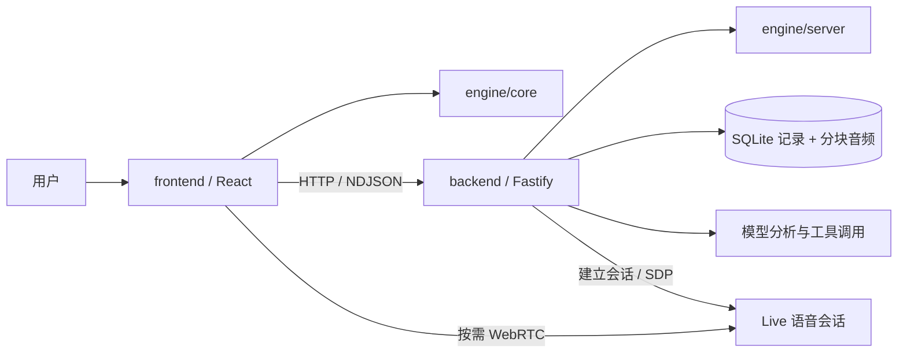
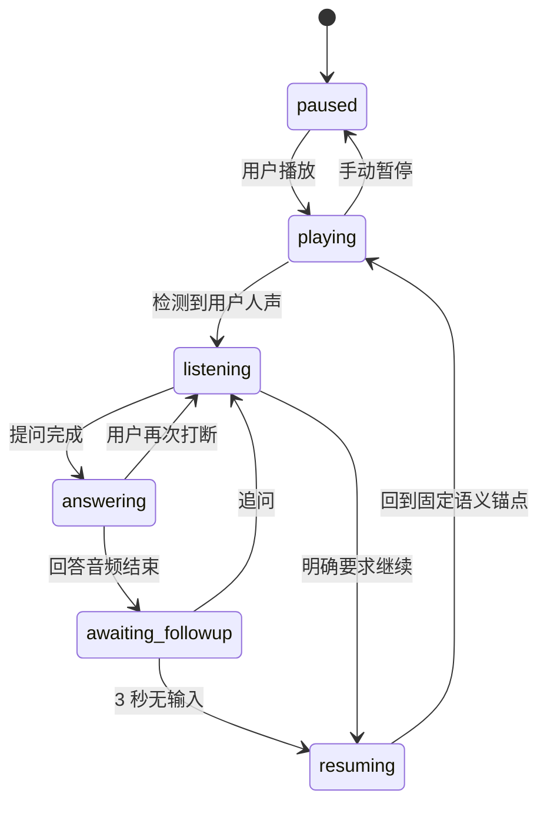

# Aside 架构说明

本文描述当前实现。播放器语音遥控、持续 Live 连接和 NDJSON 命令的最新行为见[播放器遥控](player-controls.md#live-遥控链路)，其生命周期说明取代下文和 ADR 0002 中自动模式的按需连接描述。历史决策见 [ADR 0001](adr/0001-interactive-podcast-architecture.md) 和 [ADR 0002](adr/0002-on-demand-live-sessions.md)；与旧设计不一致时，以当前代码及本文为准。

## 模块边界

| 模块            | 负责                                                         | 主要入口                                                                                               |
| --------------- | ------------------------------------------------------------ | ------------------------------------------------------------------------------------------------------ |
| `engine/core`   | 浏览器安全的类型、播放状态转换、固定续播锚点和 revision 校验 | `engine/src/core.ts`                                                                                   |
| `engine/server` | 分析结果组装、声音选择、上下文构造、已听内容检索             | `engine/src/server.ts`                                                                                 |
| `backend`       | HTTP、持久化、音频处理、任务恢复、模型与工具执行             | `backend/src/app.ts`、`jobs.ts`、`question-service.ts`、`provider.ts`                                  |
| `frontend`      | 页面组合、播放器界面、原音频播放、本地 VAD 与按需会话       | `frontend/src/main.tsx`、`PlayerView.tsx`、`usePlayerController.ts`、`listening-session.ts`            |

`engine/contracts` 提供浏览器安全的请求、回答、来源、进度、错误与 checkpoint 契约，Zod schema 派生 TypeScript 类型。JSON 与 NDJSON 共用回答校验，并检查请求/响应 revision。

Engine 不依赖 Fastify、React、数据库或模型 SDK。前端不得导入 `engine/server` 或后端实现。`scripts/check-boundaries.mjs` 在类型检查之后检查这些导入边界。本地模式由 backend 进程同时运行 API 与分析队列；新增 Cloudflare 模式由 Worker 处理 API、Workflow 编排分析、Container 执行 FFmpeg，D1/R2 保存数据，详见 [Cloudflare 后端](cloudflare.md)。

## 收听运行时与展示

- `ListeningSession` 持有播放 reducer、设备连接和完整收听操作。定位、提问、停止都由它保证取消与设备动作的先后顺序。
- `Conversation` 统一持有问答轮次、过期请求、字幕、委派、回答音频分类、延迟记录与续播等待；使用注入的 `RuntimeClock`。
- `usePlayerController` 订阅运行时快照，处理节目列表、载入、轮询、checkpoint 与浏览器偏好。`PlayerView` 负责节目标题、底部播放栏、对话、键盘快捷键和页面动效；`Transcript` 负责逐句显示、跟随滚动及句首跳播按钮。点击句首按钮经 controller 的 `seek` 清除旧打断/续播任务，再调用 `startListening` 播放。公开试听与 My Space 复用同一播放器。`Space` 让左侧上传按钮直接打开文件选择器，在侧栏展示预检、上传状态和私人列表；中间只承载播放器或空库提示。`main.tsx` 只组合路由、账号状态和两种页面外壳，不接触 voice 实例、可写 state/history 引用或底层 dispatch。
- `BrowserPodcastAudio` 是原音频的 DOM Adapter，`player-api.ts` 是前端 HTTP Adapter；按需语音仍由 OnDemandVoice 管理。

详见 [ADR 0003](adr/0003-listening-and-question-ownership.md) 和 [领域语言](../CONTEXT.md)。

## 音频分析

1. 本地模式将上传字节流分块写入 SQLite 对象存储；Cloudflare 私人 Space 使用 R2 分片上传，单文件限制 1 GiB、最长 5 小时。两种模式均通过 ffprobe 验证音频并读取时长。
2. ffmpeg 根据静音位置切出约四分钟的片段，转为单声道压缩音频。
3. 各块依次进行转录和音频理解，保留句级时间戳、说话人声音倾向、语义分组、摘要和表达风格。转录只请求 segment 粒度；音频理解收到的是 `{id, startMs, endMs, text}` 的提纲，不是完整 passage。
4. Engine 将结果组装为整期内容地图，形成 Transcript 和自然续播点。声音按说话时长汇总选择预设，未知情况使用回退规则。
5. 全部分析完成后，节目进入可互动播放状态。

转录与分析分阶段缓存，重试复用已有成功结果。服务启动时恢复被中断的分析任务。模型原始返回先落盘，再执行完整性检查、JSON 解析/修复和 schema 校验；不将截断输出当作成功结果。SDK 禁用自动重试，避免不透明地重复调用付费接口。

Cloudflare Workflow 已按段有界并发转录与分析（`ANALYSIS_CONCURRENCY`，默认 6），见 [Cloudflare 部署](cloudflare.md)。**本地 Jobs 仍为串行**；未来可在 Jobs 层加入有界并发，保持块 ID、缓存与合并顺序稳定，避免把并发逻辑扩散到 UI。

## 播放、打断与续播

原播客始终由浏览器音频播放器播放。自动插话模式下，点击播放同时启用本地麦克风；按住说话模式首次按住时才申请麦克风，忽略自动人声事件，松开后提交该次本地 WAV，连续追问仍按此流程但复用云端输出连接。手动模式的 WebRTC 输入轨道始终禁用，录音不包含按下前的环境声音。只听节目模式不启用麦克风，仍可文字问答。手动暂停关闭监听和云端会话，Agent 引起的暂停则保留监听。按住说话模式续播时关闭麦克风和云端会话。

图示为主要体验路径，代码还处理连接恢复、错误与取消。第一次打断时锁定恢复位置；同一轮连续追问不改写锚点。恢复时回到完整语义段落起点，并留少量音频提前量，避免从半句话继续；段落起点远于 12 秒时改从 12 秒内最早的句首继续，并以 400ms 淡入。

回答音频结束后等待服务端的 `ASIDE_AUTO_RESUME_MS`（默认 2 秒），文字回答完成后也使用相同等待窗口。Web 没有等待时长选择；移动端默认 3 秒，可选 3 秒、8 秒或手动继续。回答超过 350 个字符或包含超过 180 个汉字时，移动端和未朗读的文字回答的窗口至少为 8 秒；这是长度启发式，不判断问题的实际复杂度。新语音、文字输入和新任务会取消计时。“先别继续”在当前整轮追问中持续有效，主动续播后重置。明确的续播指令采用保守短语匹配，命中后约 1.5 秒续播；不明确的表达由后端语义判断和 `resume_podcast` 工具处理。计时以客户端观察到的事件为准，实际还会受到语音转录和音频结束检测延迟影响。聊天超过 60 秒时，界面显示打断前最近一段完整听过的节目原文作为回顾，不额外生成或播报语音，不引入未听内容。

## 麦克风与成本控制

`microphone.ts` 使用本地 Silero V5 / ONNX 检测人声，模型和 WASM 资源从本站加载。达到概率阈值、低音量底线和连续时长条件后才触发打断。`microphone-buffer.ts` 保存短暂前滚音频，避免丢掉开头。关闭 VAD 时才使用旧的纯 RMS 触发方式。

`on-demand-voice.ts` 管理两种不同生命周期：

- **本地监听**：播放期间持续存在，浏览器计算，不建立持续云端监听。
- **Live 连接**：第一次提问时创建；同一次打断的多轮对话复用，续播后保留 5 秒，空闲默认 60 秒关闭。

冷启动先收集本地提问音频，转录与建立 Live 会话并行准备。已连接时走实时音频。Live 使用麦克风流的克隆，关闭云端连接不销毁原始本地监听流。版本检查和串行关闭防止旧连接、旧回答覆盖新一轮状态。

语音连接或麦克风失败时，错误界面保留继续听的操作；播放中的原音频不会因为云端断开而暂停。正在问答时保留恢复锚点并取消自动续播，等用户选择继续或重试。按钮松开、失焦、页面隐藏、切换模式和切换节目均会结束或取消手动捕获；延迟到达的麦克风权限结果不能启动新录音。续播期间的旧字幕和工具委派会被忽略。

这减少空闲云端会话时间，但不会消除首次连接延迟或实际问答费用。外放节目也是人声，VAD 不能单独保证识别其来源，仍依赖回声消除和耳机。

## Agent、上下文与工具

后端 `question-service.ts` 编排问答、执行工具并收集来源；`provider.ts` 的 OpenAIProvider 只转换模型协议与分析/语音接入，Live 负责实时语音交互与表达。后端最多执行五轮模型/工具循环，支持：

| 工具             | 用途                   |
| ---------------- | ---------------------- |
| `get_passage`    | 读取指定节目片段       |
| `search_podcast` | 在允许的节目内容中检索 |
| `web_search`     | 获取外部补充资料       |
| `resume_podcast` | 表达明确的续播意图     |

上下文包含打断位置、当前已听片段、近期内容、较早片段及对话历史。全文预分析不意味着全文直接喂给问答：默认按播放位置限制节目证据，避免提前透露后续内容。节目检索目前是关键词检索，不依赖向量数据库。

Agent 被指示以当前节目人物的第一人称视角解释，并区分不同说话人的观点；不得编造人物私生活、未表达的立场或背书。回答语言跟随最新用户提问。后端和 Live 提示均要求简单问题先用两三句口语解释，用户要求或追问时再展开，避免重复问句、列表和每次都邀请追问。此行为依赖模型遵循指令，需要真实听感验证。多人节目的输出仍只有一个预设声音。

长任务通过 NDJSON 返回工作阶段。前端等待一段时间后，按阶段触发简短语音提示，最多两次且有间隔；提示跟随用户语言。它不是检索结果。最终结果、取消和新问题会停止过期提示。

客户端 `response-latency.ts` 记录本地提问结束到第一段回答音频的耗时，区分 cold / warm，排除工作进度语音和已取消的轮次；最近 20 个样本仅保存在当前页面内存并出现在开发观察中。该指标包含客户端转录、连接和生成等待，并受音频检测精度影响，不是供应商内部延迟。

每个问题带 revision；前端取消、后端 AbortSignal 和结果校验共同防止旧回答回流。正在执行工具时不启动自动续播计时。

## 持久化与接口

默认数据库目录为 `.data/`，可通过 `ASIDE_DATA_DIR` 覆盖。SQLite 使用 WAL，保存节目、播放 checkpoint、Live 使用记录、逐字稿、分析缓存、模型原始输出及问答任务状态；原音频保存在数据库的分块对象表。媒体适配器将音频临时物化供 FFmpeg 使用，用完清理。checkpoint 包含播放位置和对话历史。云端会话本身不会因持久化而永久存活。

主要 HTTP 接口均在 `/api` 下：

| 路径                                | 方法       | 用途                |
| ----------------------------------- | ---------- | ------------------- |
| `/health`                           | GET        | 服务与公开配置      |
| `/episodes`                         | GET / POST | 列表与上传          |
| `/episodes/:id`                     | GET        | 节目及分析状态      |
| `/episodes/:id/retry`               | POST       | 重试失败分析        |
| `/episodes/:id/audio`               | GET        | 支持 Range 的原音频 |
| `/episodes/:id/checkpoint`          | GET / PUT  | 恢复播放与历史      |
| `/episodes/:id/question`            | POST       | JSON 或 NDJSON 问答 |
| `/episodes/:id/transcribe-question` | POST       | 冷启动提问转录      |
| `/episodes/:id/live`                | POST       | Live 会话协商       |
| `/episodes/:id/usage`               | GET / POST | 使用时间记录        |
| `/admin/usage`                      | GET        | 问答成本账本汇总    |

API Key 只在后端读取；配置通过显式白名单提供给前端。使用时间记录不是供应商账单，断线等情况可能造成统计不完整。

`/api/admin/usage` 只在 Cloudflare 模式存在，用 `ADMIN_KEY` 共享密钥认证（`x-admin-key` 请求头，不走 query），未配置密钥时该路由表现为不存在。它在 session 与账号解析**之前**处理，所以运维调用不会领到试听身份或 Cookie。每次问答（含失败）在 D1 `question_usage` 落一行：实际服务档位、轮数与 input/cached/output/reasoning token，匿名试听与登录账号按 `account_id` 是否为空区分。保留 90 天，由既有的 cron 清理。查询用 `node scripts/admin-usage.mjs`，或 `aside-usage` skill。

## 部署边界

当前 API 绑定 loopback，开发前端通过 Vite 代理访问，没有多用户认证。前端构建只生成静态资源，不包含生产后端启动器。

Cloudflare 入口已实现匿名签名会话与隔离、D1/R2 存储、私人分片上传、Workflow 和音频 Container。账号层支持邮件验证码/Google 登录与 profile，登录后以稳定账号 ID 访问私有数据；私人 Space 已上线上传、自动分析、个人列表和删除。Google 登录已在 PAX Chrome profile 中通过线上回调；邮件验证码登录、profile 保存、头像上传和真实私人音频上传的生产交互仍待验证。Live 由持久化监督器执行服务端到期关闭。Cloudflare 本地验证与远端部署是不同的证据，配置与限制见 [Cloudflare 后端](cloudflare.md)、[用户账号](accounts.md)和[个人 Space](personal-space.md)。
