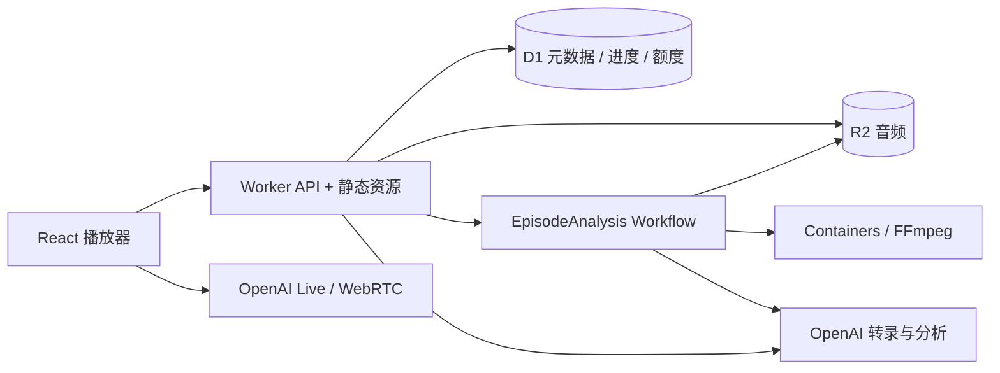

# Cloudflare 后端

本地 Node/Fastify 模式继续可用；新增 Cloudflare 入口复用 engine、问答策略和模型协议。生产部署使用 `wrangler.production.jsonc`，目标为 `https://asidefm.com`；本地开发仍使用 `wrangler.jsonc`。实际资源与验证状态见 [生产部署记录](deployment.md)。

## 组成



- `cloudflare/src/api.ts`：Fetch API 适配器，保持播放器已有 JSON/NDJSON、Live、checkpoint、usage 接口。
- `cloudflare/src/auth.ts`：邮件验证码、Google OAuth、持久账号会话与 profile；配置和迁移见[用户账号](accounts.md)。
- `cloudflare/src/store.ts`：异步 D1/R2 存储。D1 保存元数据与完整处理结果，`records.ts` 把大 JSON 拆成多行并通过 batch 原子替换；R2 只保存音频。
- `cloudflare/src/pipeline.ts`：与 Workflow SDK 分离的分析编排；`index.ts` 连接真正的 Workflow/Container bindings。
- `backend/src/container/app.ts`：内部 FFprobe/FFmpeg HTTP 服务，仅处理 Worker binding 传入的字节，不接受外部 URL、文件路径或命令。
- `backend/src/interactive-provider.ts`：不依赖文件系统的问答与语音协议。
- `backend/src/audio-provider.ts`：音频字节转录/分析，显式注入模型原始输出保存函数。
- `backend/src/provider.ts`：本地模型适配器，接收音频字节和证据持久化回调，不读取文件路径。

## 本地运行与验证

需要 Node 24+、FFmpeg 和 Docker。所有命令从仓库根目录运行。

```bash
npm ci
npm test
npm run test:cloudflare
npm run build
cp .dev.vars.example .dev.vars
# 在本机私密编辑 .dev.vars，生成随机 SESSION_SECRET；按需填 OpenAI key。
npm run db:cloudflare:local
npm run dev:cloudflare
```

访问 `http://localhost:8787`，与 `wrangler.jsonc` 的 `APP_ORIGIN` 一致。`127.0.0.1` 是不同 Origin。默认没有示例数据，上传关闭。需要测试上传时，使用 `npx wrangler dev --var ALLOW_UPLOADS:true`，模型费用由配置的 API key 承担。

```bash
# Worker 构建，不构建/推送容器，不连接远端资源
npm run build:cloudflare
# 单独验证生产需要的 amd64 镜像
npm run build:media
```

`test:cloudflare` 使用本地 workerd、D1、R2 和 Workflow，拦截外部模型请求，不消耗模型额度。覆盖私有节目和公共节目权限、进度隔离、Range、签名会话、并发额度、分片上传、重复完成、真实 Workflow 编排、分析失败复用和本机 FFmpeg。Workflow 集成测试的容器传输是模拟的，FFmpeg 服务另行实测；不能把它当作线上容器调度或真实模型证明。

## 远端部署

以下命令会创建资源或部署，开发验证不会自动执行它们。

1. Cloudflare 账号开通 Workers Paid/Containers；使用 Wrangler 登录。
2. 创建 D1 与私有 R2 bucket：

```bash
npx wrangler d1 create aside
npx wrangler r2 bucket create aside-audio
```

将返回的 D1 ID 填入 `wrangler.jsonc` 的 `database_id`，把 `APP_ORIGIN` 改为最终 HTTPS 地址。

3. 在 Cloudflare Turnstile 创建站点，绑定实际域名（上线时为 `asidefm.com`），将公开 site key 填到 `TURNSTILE_SITE_KEY`。本地调试可使用 Cloudflare 官方测试 key，但不得带入生产。设置 Secrets，使用 Wrangler 的交互式输入，不把值写入代码、命令参数或部署配置：

```bash
npx wrangler secret put SESSION_SECRET
npx wrangler secret put OPENAI_API_KEY
npx wrangler secret put TURNSTILE_SECRET_KEY
npx wrangler d1 migrations apply DB --remote
npm run build
npx wrangler deploy
```

Dockerfile 的构建上下文是仓库根目录。`.dockerignore` 排除 `.env`、`.dev.vars`、本地音频、数据库和运行产物。音频容器没有模型 key 或 R2 凭据；源音频经 binding 传入，编码结果交给 Workflow 保存。

4. 配置 R2 multipart 生命周期（例如一天后清理未完成 multipart），并确认 bucket 没有启用公共开发 URL。应用没有给外部开放容器转发路径。
5. 用两个独立浏览器验证身份隔离；上传一段有权限处理的短音频；验证分析、Range 播放、首次语音、追问、续播，以及容器重启后恢复。最后再开放参赛入口。

## 上传与恢复

前端根据 `/api/health` 的 `uploadMode` 自动选择本地 multipart 表单或云端分片接口：

| 路径                             | 方法   | 含义                                                 |
| -------------------------------- | ------ | ---------------------------------------------------- |
| `/api/uploads`                   | POST   | 提交 title/size，预留额度，返回 id/partSize          |
| `/api/uploads/:id/part?number=N` | PUT    | 上传一个严格校验大小的分片，返回 partNumber/etag     |
| `/api/uploads/:id/complete`      | POST   | 按序提交 parts；幂等完成 R2 对象并启动同 ID Workflow |
| `/api/uploads/:id`               | DELETE | 取消尚未完成的 multipart                             |

每片 8 MiB，经 Worker 写 R2，单文件最多 1 GiB；没有采用 S3 预签名直传，因此不需要额外 R2 access key/CORS。客户端顺序上传并显示已完成字节进度，分片失败或主动取消会终止未完成上传；完成请求失败不会盲目删除可能已开始分析的对象。完整文件由容器校验音轨和真实时长，最长 5 小时，超过限制时在模型调用前拒绝并删除原件。

Workflow 分为切分音频、每段转录、每段分析、组装四类步骤。只有「切分音频」使用媒体容器：同一步内把原音频流给随机选中的实例，一次解码同时检测停顿并转成 24kHz/48kbps 单声道音轨，再不重新编码按停顿切段，把全部分段与封面写入 R2、清单写入 D1 后才结束；容器实例丢失只会重试这一步（最多 5 次，1 分钟起指数退避），后续步骤不依赖容器磁盘。清单与所有分段已在 R2 时整步跳过。各段的转录→分析按 `ANALYSIS_CONCURRENCY`（默认 6）有界并发，结果按段序组装，进度只增不减；某段失败后不再启动新段，已在执行的步骤结束后整体失败。D1 的 `artifacts` 表保存 manifest、逐字稿、语义分析、完整分析和原始模型证据；R2 仅保存原音频与编码分块；步骤输出只保存小的 artifact key。每步最多自动重试三次，SDK 不额外重试。模型已返回而持久化未成功时，仍可能发生重复付费调用，不能承诺 exactly-once 计费。

两个固定容器槽位限制并发资源；每个容器串行处理媒体操作。空闲五分钟休眠。容器缓存丢失时，Workflow 从 R2 重新传入原音频。完成/失败后尽力清理临时文件；临时文件不作为持久数据。

## 访客与额度边界

- 访客使用有效期七天的 HMAC 签名 HttpOnly/SameSite cookie；HTTPS 时附带 Secure。私有节目的 metadata、音频、完整分析仅 owner 可访问；公共示例的 checkpoint 和 usage 仍按访客隔离。
- 未登录访客仍使用匿名试用身份；清 cookie 或过期后无法找回未认领的私有上传。线上账号系统已在登录时认领当前访客数据，之后由稳定用户 ID 隔离。新上传只对登录账号开放；个人 Space 提供私人列表与删除，处理中的删除使用墓碑并由 Cron 重试清理。
- 新部署没有公共节目。发布样例需要显式导入有展示权的素材、R2 音频与 D1 分析、metadata，并设置 `public=1`；不会自动上传本机 `.data`。
- 访客进入收听时先由浏览器处理麦克风权限，随后在同一进入流程中显示 Turnstile；取消验证仍可听官方示例，首次 AI 操作会再次要求验证。后端验证 hostname、action 和访客 cData；成功证明绑定签名 cookie 和 IP，有效期 6 小时，覆盖最长 5 小时的音频。已登录账号免 Turnstile，但仍受账号、IP、全站额度和速率限制。缺少 site key/secret 时访客付费入口关闭。不会只凭前端的验证结果发放额度。
- 每 UTC 日，每访客最多 5 次后端提问、5 次录音转写、5 次 Live 创建；同 IP 分别最多 20/20/10 次，全站分别最多 100/100/10 次。三类独立计数，语音启动和首次转写可以并行。使用 D1 原子预留，失败也占额度；后续检查失败时较早预留的额度不退还。
- 测试网络可通过 Worker secret `TRIAL_TEST_IP_HASHES` 配置每日额度豁免（逗号或空白分隔的 `trial_proofs.ip` HMAC 值，不放原始 IP）。只匹配 Cloudflare 的 `cf-connecting-ip`，不接受客户端 `X-Forwarded-For`。匹配后问答、转写、Live 不扣个人/IP/全站每日额度，也不受这些额度耗尽影响；验证、速率限制、并发位、Live 时长和全站紧急开关仍生效，上传额度不变。`GET /api/trial` 的 `dailyLimitExempt` 可用于只读核验。测试网络共享同一公网 IP 的设备都适用；换网络或轮换 `SESSION_SECRET` 后需更新哈希，清空 secret 可撤销。测试请求仍会产生模型费用，且不计入公共 trial 日计数；问答成本仍进入 `question_usage`。
- 每分钟每访客最多 12 次受保护操作、同 IP 最多 60 次；包含验证请求。IP 只取 Cloudflare 注入的 `CF-Connecting-IP`，以 HMAC 保存，不采用 X-Forwarded-For。换 IP 和 cookie 仍可绕过个人额度，全站额度继续限制付费调用。
- 每访客最多 1 个后端提问/转写请求和 1 个 Live 会话；全站两类各最多 10 个并发。后端请求租约 90 秒，模型请求最多 60 秒，转写最多 30 秒。Live 占用只在服务端确认结束后释放，不随 cookie、浏览器断开或租约时间自动释放。
- 问题录音仅支持单声道 16-bit PCM WAV，后端校验采样参数及真实数据长度，最长 30 秒。会话最多 20 条、每条 2,000 字符、合计 8,000 字符；模型单次输入最多 32 KB、输出最多 600 tokens、最多 3 轮模型调用、每轮最多 8 个函数调用。匿名试用关闭外部 web search，保留节目内检索。
- 已部署代码要求上传登录，默认每个账号每个 UTC 自然月最多 100 个有效上传（上传中或已完成，`MONTHLY_UPLOAD_LIMIT`）、全站每 UTC 日最多 2000 个（`GLOBAL_DAILY_UPLOAD_LIMIT`）；主动取消待上传任务会释放名额。另限制每账号每天 10 次上传尝试，全站每天的上传尝试为全站上限的 3 倍（6000 次），并按每账号 20 GiB、全站 100 GiB 限制保留的原音频。失败分析重试使用独立额度（每账号 2 次、全站 10 次），不占上传名额。当前生产 `ALLOW_UPLOADS=true`；线上尚未做真实账号上传与额度耗尽验证。
- Live 创建前持久化 120 秒截止时间，并预留一次完整会话额度；全站每天最多发放 10 个，即名义 20 分钟。`LiveSupervisor` 通过供应商 sideband WebSocket 监听和控制会话，到期发送 `session.close`。只有收到该后端连接的 `session.closed` 才释放占用；浏览器 usage 仅为估计，不作为计费或关闭证据。
- sideband 失败会重连；无法确认关闭时记录 `trial_breakers`，暂停所有新 AI 调用，并继续尝试关闭已知会话。若创建请求结果不明且没有 session id，保持熔断并等待人工核对，不能盲目重试创建。明确的供应商 4xx 拒绝（408 除外）释放并发位，但不退每日额度。
- 定时任务和网络可能延迟，因此 120 秒是服务端执行的关闭目标，不是供应商金额硬封顶。上线前仍须真实验证 WebRTC + sideband + 关闭计费；本地测试使用模拟供应商事件，没有产生真实模型请求。
- `AI_ENABLED=false` 可关闭 AI。无需重新部署的紧急开关是 `trial_control.enabled=0`；新问答/转写/上传/重试会拒绝，分析流水线在下一次模型调用前停止，现有 Live 通常在 5 秒轮询时发现（创建中的调用可能更久）。音频播放仍可用。正在执行的后端模型调用受原超时限制。
- 五分钟 Cron 清理过期证明、短期限速计数和旧每日计数，不清理未确认关闭的 Live 占用。
- `SESSION_SECRET` 不能使用示例值；轮换会让旧匿名身份失效。服务端错误不会把 SDK 异常、密钥或 transcript 返回给用户。

平台依据：[Workers](https://developers.cloudflare.com/workers/)、[Containers](https://developers.cloudflare.com/containers/)、[Workflows](https://developers.cloudflare.com/workflows/)、[D1](https://developers.cloudflare.com/d1/)、[R2](https://developers.cloudflare.com/r2/)。

## 试用开关与故障处理

以下是运维命令，不会在本地验证时自动执行：

```bash
# 立即停止发放 AI 请求；音频仍可播放
npx wrangler d1 execute DB --remote --command "UPDATE trial_control SET enabled=0 WHERE id=1"
# 查询未确认关闭的访客；不要仅删除占用或重置额度
npx wrangler d1 execute DB --remote --command "SELECT owner FROM trial_breakers"
# 供应商故障和未关闭会话核对完成后恢复；breaker 仍独立生效
npx wrangler d1 execute DB --remote --command "UPDATE trial_control SET enabled=1 WHERE id=1"
```

有 session id 的会话通过持久 alarm 自动重连、关闭和清除熔断。创建结果不明或错过终止事件的会话需要人工对照供应商状态、核对 Durable Object 持久状态后处理；不要为了恢复流量直接清空 `trial_breakers` / `trial_leases`。当前没有公共管理员重置接口。

本地验证新增覆盖：验证缺失、过期、重放和绑定错误，五次额度与并发抢占，伪造录音长度，超长输入，无客户端配合的服务端语音到期关闭，虚假 usage 无法释放占用，未确认关闭的熔断，以及明确创建拒绝不误触全局熔断。浏览器测试验证并行请求只弹出一次验证、取消验证不发送付费请求。

接口依据：[Turnstile 服务端验证](https://developers.cloudflare.com/turnstile/get-started/server-side-validation/)、[Live sideband WebSocket](https://developers.openai.com/api/reference/resources/live/sideband-websocket)、[Durable Object alarms](https://developers.cloudflare.com/durable-objects/api/alarms/)。WebRTC 使用 sideband 的 `session.close`，不使用仅用于 SIP 的 hangup 接口。

存储改造包含 `0003_artifacts.sql`，账号系统新增 `0004_accounts.sql`；已有本地文件数据通过 `npm run migrate:storage` 迁入 SQLite，不会自动上传到 D1/R2。见 [数据库存储说明](storage.md)。
