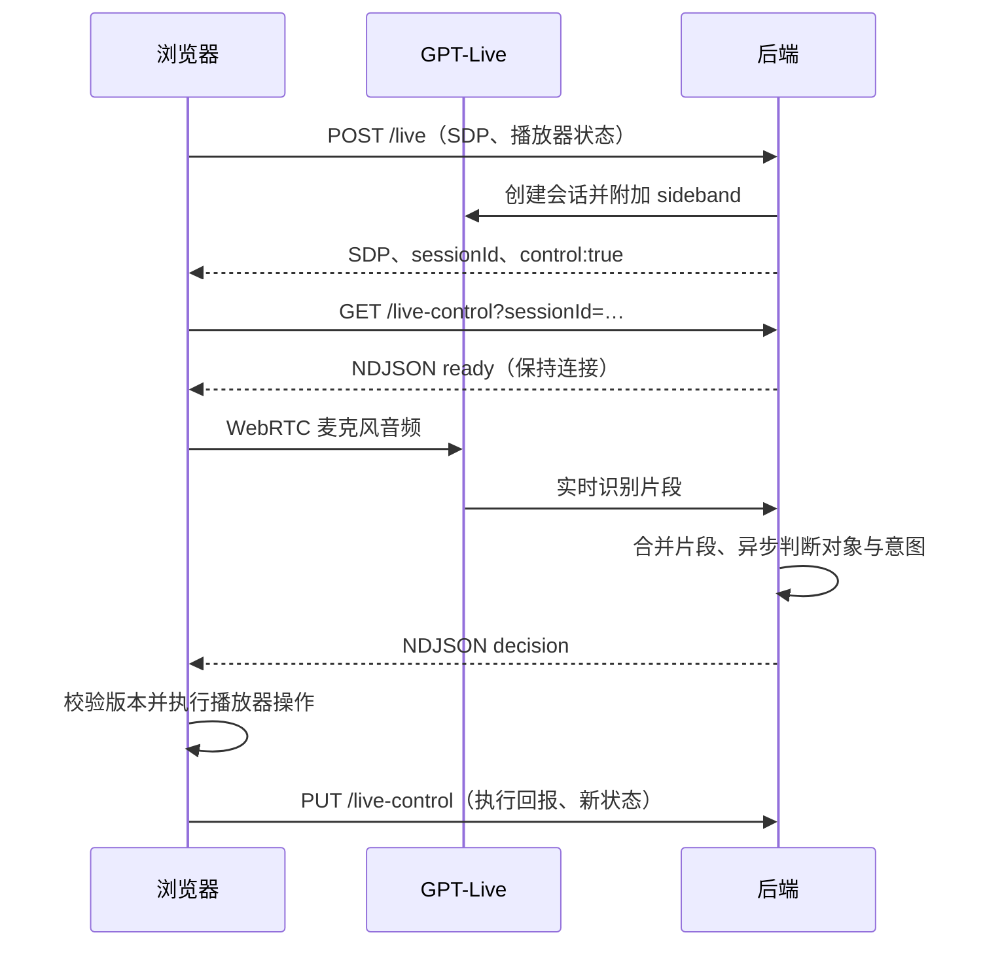

# 服务端语音控制

自动模式开启后，音频通过 WebRTC 从浏览器送到 GPT-Live。后端在返回 SDP 前附加 sideband，并在浏览器打开控制流后持续解释 `session.input_transcript.delta`。浏览器字幕、本地 VAD 和 `session.delegation.created` 都不是意图判断的开关。参考 [OpenAI server-side controls](https://developers.openai.com/api/docs/guides/voice-server-controls) 和 [transcript fragments](https://developers.openai.com/api/docs/guides/live-delegation#react-to-transcript-fragments)。

Workers 的 sideband 握手限时 5 秒，但收到升级响应后必须清除定时器。`fetch` 的取消信号在 WebSocket 升级后仍关联连接，直接使用 `AbortSignal.timeout(5000)` 会在约 5 秒时切断已经建立的连接。集成测试在握手后等待超过该期限，再验证连续两条 NDJSON 决策。

在带 `?debug` 的页面打开 Developer details，可查看独立的诊断工作区：浏览器听到的文本、后端收到的文本、后端正在判断的文本，以及麦克风和 NDJSON 状态。连接原始信息和播放器事件默认折叠；工作区内部滚动，底部播放器保持可用。关闭面板恢复字幕和对话。面板本身不会启动麦克风或播放音频。



所有 URL 都在 `/api/episodes/:id` 下。文字问答、按住说话以及连接尚未就绪时的首句 WAV 转写仍使用已有接口；正常实时遥控不会逐句请求 `/question`。冷启动录音路径仍需等录音结束，不代表实时路径延迟。

## 协议

`POST /live` 的可选 `control` 含 `player` 和 `debug`。`player` 包括 `version`（手动操作使旧结果失效）、递增 `sequence`（忽略乱序状态更新）、播放 `revision`、`positionMs`、`wasPlaying`、`audibleSource` 和播放器配置。

`GET /live-control?sessionId=…` 返回持续的 `application/x-ndjson`：

- `ready`：会话通道就绪，之后才启用 Live 麦克风输入。
- `observing`、`classifying`：后端已收到片段、已开始判断；仅 `debug:true` 带诊断原文。
- `decision`：`decisionId`、`version`、输入时的 `player` 快照、被接受的 `text` 和原有 `QuestionResult`。`ignore`、`wait` 不携带原文，不影响播放或音量。
- `heartbeat`：15 秒一次。
- `error`、`closed`：明确终止通道，前端关闭语音并提示重新连接，保留播放器可用。

执行完决定后，`PUT /live-control` 上报 `{sessionId, player, acknowledgement:{decisionId, applied}}`。同一个 `decisionId` 只执行一次。`applied:false` 表示版本过期或执行被拒绝。位置播放中每秒同步，手动操作立即同步；这不是意图请求。播放回报不证明用户已听到媒体。

Cloudflare 通过已认证身份选择对应的 LiveSupervisor，再核对节目和会话 ID；会话 ID 本身不能授权另一个用户订阅或修改。每个 Live 会话只接受一个控制流。Fastify 本地开发模式保持原有单用户边界，复用同一判断与推送实现。

## 调度和生命周期

首个非空片段启动 160ms 合并窗口，不等 VAD speech-end，也不等待 delegation。每个会话最多一个模型判断在途；途中更新的文本在后续判断中合并。文本发生变化或手动操作使结果过期时丢弃旧决定。`ignore` 和 `wait` 都允许后来追加的内容再次判断；不能因为先听到旁人聊天就丢弃随后的控制语句。

识别时间戳间隔超过 1.2 秒形成新输入快照；没有时间戳时使用接收时间。重复带时间戳的识别帧去重。重播参考收到本轮首片段时最后同步的播放位置，播放中通常有最多约一秒的状态采样误差，另加网络和识别延迟。

有动作的决定等待执行回报，回报前不再发出下一动作。已经处理的文本通过 `handledText` 交给后端，防止追加礼貌用语或迟到委派重复执行相对调速。混合控制与问题先推送操作，收到回报后由后端继续回答 `followUpQuestion`。

侧边连接或控制流断开即取消判断；没有自动重放指令。旧页、换集和停止收听会中止订阅。当前采用明确报错后重新连接，尚未实现断网后的自动恢复。浏览器不支持通道时显示错误，不退回关键词判断。

## 成本与验证

生产保留现有 120 秒 Live 会话上限。开启服务端遥控时预留一次 Live 和一次 question 试用额度；不逐片段消耗每日额度或公开提问接口的频率额度。已配置的测试 IP 豁免仍适用。会话最多 30 次增量判断，每次超时 15 秒，工具循环最多 3 轮；执行回报超时 10 秒。紧急关闭开关仍在后端生效。频繁旁人聊天仍会产生判断成本，达到上限时明确提示重新连接。

测试覆盖 sideband 到 NDJSON 的 Worker 链路、用户隔离、前端没有字幕/委派时仍能执行推送、旁人聊天、旧结果、重复指令、断线和多个决定。模型以替身测试；真实 OpenAI 的语义准确率和端到端延迟需实际语音验证。

```sh
npm test
npm run test:voice-control-coverage
npm run test:cloudflare
npm run build
npx playwright test tests/browser/voice-remote.spec.ts
```
