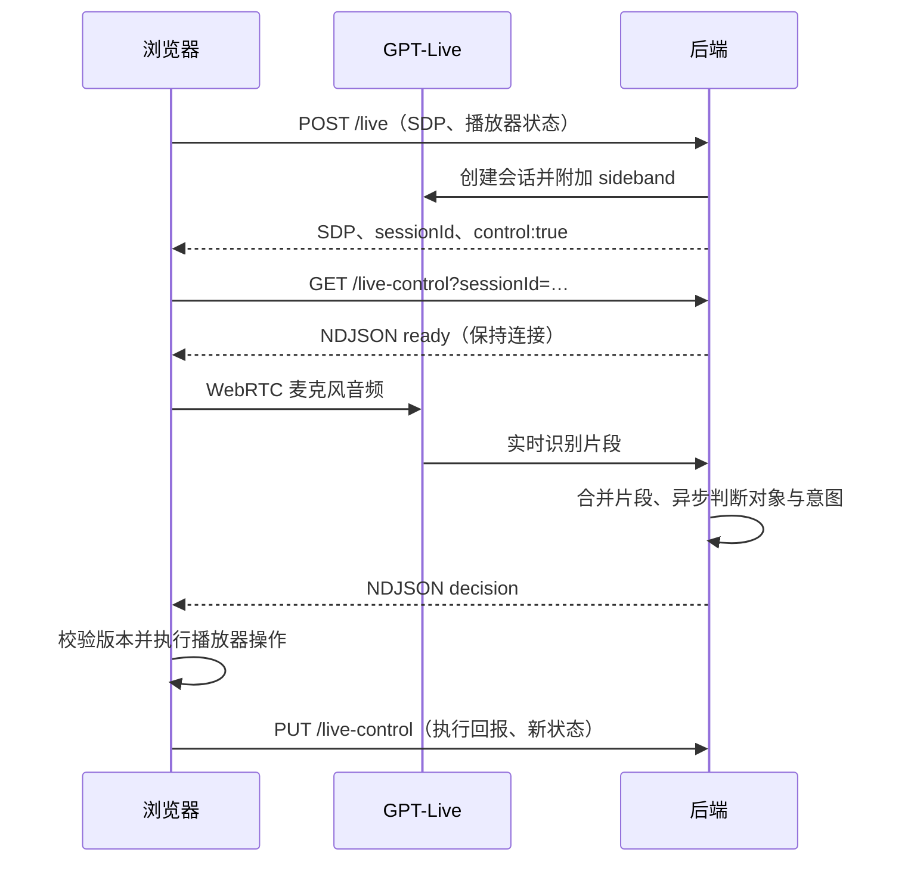

# 服务端语音控制

## 同一段对话中的播放器工具

对话和播放器操作使用同一个 `QuestionService` 模型与工具集合。用户无需切换模式，也不需要说出“播客”或固定命令；模型结合连续对话决定回答、使用播放器工具，或静默等待/忽略旁人聊天。文字输入也经过模型，不再用“继续”的正则表达式跳过对话理解。

`LiveConversation` 保存被接受的用户输入、客户端允许播出的助手转录和最近四次播放器工具回报。后端准备的回答不直接充当已说出的历史；Live 的实际措辞会由共享播放器 runtime 回传。只有对应已接受回答的输出能写入会话，静音的自发输出和未知决定的回报被丢弃。输出状态为 queued / speaking / finished / interrupted；转录与音频播放并非逐字精确对齐，所以中断记录表示进入允许播放窗口的前缀，不证明每个字都已经被用户听到。

客户端通过已有 `PUT /live-control` 同步可选 `player.playback`（模式、是否因对话中断、恢复位置）和 `player.assistant`（决定 ID、实际输出转录、交付状态）。转录更新最多每 250ms 合并一次，结束和中断立即同步；它们是上下文更新，不会调用前端意图分类。旧客户端仍可使用原来的协议，但完整的已播回答上下文需要更新客户端。

下一轮模型获得 `conversation.playback`、`conversation.assistant`、`conversation.recentActions` 和同一份历史。例如完成解释后的“OK, go on”可以恢复播放；对“Shall I resume?”说“Yes”会恢复，对“Would you like more explanation?”说“Yes”会继续解释。工具回报中的 accepted 只表示客户端接受，是否已经播放要看最新状态。恢复工具不再额外等待 1.5 秒。

短确认和最后一段回答回报可能交错；新增上下文会让基于旧历史的未处理决定失效并重新判断。同一句输入最多因上下文更新重试一次，避免持续的助手转录让中断请求一直失效或反复判断旁人聊天；用户追加的新内容仍会继续判断。已处理的输入不会因助手输出更新而再次执行。诊断面板可查看实际输出和最近一次模型看到的对话上下文，原文仅在显式 debug 模式下进入诊断帧。

自动模式开启后，音频通过 WebRTC 从浏览器送到 GPT-Live。后端在返回 SDP 前附加 sideband，并在浏览器打开控制流后持续解释 `session.input_transcript.delta`。浏览器字幕、本地 VAD 和 `session.delegation.created` 都不是意图判断的开关。参考 [OpenAI server-side controls](https://developers.openai.com/api/docs/guides/voice-server-controls) 和 [transcript fragments](https://developers.openai.com/api/docs/guides/live-delegation#react-to-transcript-fragments)。

Workers 的 sideband 握手限时 5 秒，但收到升级响应后必须清除定时器。`fetch` 的取消信号在 WebSocket 升级后仍关联连接，直接使用 `AbortSignal.timeout(5000)` 会在约 5 秒时切断已经建立的连接。集成测试在握手后等待超过该期限，再验证连续两条 NDJSON 决策。

在带 `?debug` 的页面打开 Developer details，可查看独立的诊断工作区：浏览器听到的文本、后端收到的文本、后端正在判断的文本，以及麦克风和 NDJSON 状态。连接原始信息和播放器事件默认折叠；工作区内部滚动，底部播放器保持可用。关闭面板恢复字幕和对话。面板本身不会启动麦克风或播放音频。



所有 URL 都在 `/api/episodes/:id` 下。文字问答、按住说话以及连接尚未就绪时的首句 WAV 转写仍使用已有接口；正常实时遥控不会逐句请求 `/question`。冷启动录音路径仍需等录音结束，不代表实时路径延迟。

## 协议

`POST /live` 的可选 `control` 含 `player`、`debug` 和 `earlyResponse`。新版 runtime 设置 `earlyResponse:true`：后端先判断是否接话，再异步准备答案；旧客户端保持完整结果的一次性决定。`player` 包括 `version`（手动操作使旧结果失效）、递增 `sequence`（忽略乱序状态更新）、播放 `revision`、`positionMs`、`wasPlaying`、`audibleSource` 和播放器配置。

`GET /live-control?sessionId=…` 返回持续的 `application/x-ndjson`：

- `ready`：会话通道就绪，之后才启用 Live 麦克风输入。
- `observing`、`classifying`：后端已收到片段、已开始判断；仅 `debug:true` 带诊断原文。
- `decision`：`decisionId`、`version`、输入时的 `player` 快照、被接受的 `text` 和原有 `QuestionResult`。`ignore`、`wait` 不携带原文，不暂停播放；`classifying` 起播客轻微降音（软让位），`ignore` 后回升，`wait` 由保持超时回升，见[播放器让位](player-controls.md#让位软让位与硬让位)。
- `decision.answerPending:true`：问题已被接受，允许 Live 接话，完整答案仍在准备。后续 `answer` 事件携带同一 `decisionId`，只补充仍有效的这一轮；完整答案不会占用下一轮意图判断的槽位。
- `heartbeat`：15 秒一次。
- `error`、`closed`：明确终止通道，前端关闭语音并提示重新连接，保留播放器可用。判断调用失败时，原因只写入服务端日志（`wrangler tail` 中的 `Aside voice intent classification failed`，含 reason、是否超时、第几次判断），前端只区分三种安全文案：试用会话已结束（120 秒上限或 AI 关闭）、判断超时（15 秒）、其它失败。

执行完决定后，`PUT /live-control` 上报 `{sessionId, player, acknowledgement:{decisionId, applied}}`。同一个 `decisionId` 只执行一次。`applied:false` 表示版本过期或执行被拒绝。位置播放中每秒同步，手动操作立即同步；这不是意图请求。播放回报不证明用户已听到媒体。

Cloudflare 通过已认证身份选择对应的 LiveSupervisor，再核对节目和会话 ID；会话 ID 本身不能授权另一个用户订阅或修改。每个 Live 会话只接受一个控制流。Fastify 本地开发模式保持原有单用户边界，复用同一判断与推送实现。

## 调度和生命周期

### 连接时预热判断上下文

带 `earlyResponse:true` 的会话在创建 Live 音频连接的同时，为判断模型建立独立 Responses WebSocket，并发送 `response.create` / `generate:false`。规则、工具定义、当前已听内容及已有对话先成为服务端基线；预热不生成回答，不调用播放器工具，也不阻塞麦克风连接。参见 [OpenAI WebSocket 预热协议](https://developers.openai.com/api/docs/guides/websocket-mode#connect-and-create-responses)。

预热完成后，判断通过 `previous_response_id` 引用基线，只追加发生变化的上下文字段及新增历史。若原历史已被截断或修改，则发送替换历史；最新播放位置、当前片段、实际输出和用户话语始终覆盖旧状态。规则和工具仍按 API 要求随请求声明。每次判断从同一基线分支，作废的判断不会混入用户实际对话。基线占一个固定 lane；最多三个判断 lane 供已取消请求排空和后续请求使用，不无限创建 lane。事实回答沿已接受的 response ID 在独立 HTTP 路径继续，保持与意图判断并行。

预热未完成、握手失败、缓存失效或连接中断时，当前请求回退为携带完整最新上下文的原 HTTP 调用。所有状态按语音会话隔离，断麦、创建失败、sideband 或 NDJSON 关闭都会释放预热连接。生产日志 `Aside voice model preload` 的 `ready`（含准备耗时）、`used`、`fallback` 和 `unavailable`（仅原因分类及错误码） 可与 `Aside voice decision.modelMs` 对照；这些时间不等于设备真正开始出声的时间。

首个含文字或数字的片段启动 160ms 合并窗口，不等 VAD speech-end，也不等待 delegation。每个会话最多一个模型判断在途；途中更新的文本在后续判断中合并。文本发生变化或手动操作使结果过期时丢弃旧决定。`ignore` 和 `wait` 都允许后来追加的内容再次判断；不能因为先听到旁人聊天就丢弃随后的控制语句。

纯空白、标点和符号片段不单独形成发言，不触发 observing/classifying，也不会撤销已排队的回答。分隔符保留到同一输入的后续文字中，例如独立的空格或分片数字 `0` / `.` / `5`；新一轮开始时清空上轮尾部符号。前端收到识别通知时，只关闭已经结束的回答窗口，不会因为声音尚未开始就把排队中的回答静音。

### Web 回答音频缓冲

WebRTC 音轨在 `<audio muted>` 时仍然前进。只等 NDJSON `answer` 到达后取消静音，会跳过已传来的开头。Web 客户端现在通过 `MediaStreamSource → AudioWorklet PCM 队列 → Analyser → destination` 播放回答；静音的媒体元素仅保持 Chromium 的远端音轨接收，不承担可听播放。

本地语音起点、Live 输入文字和后端 observing/classifying 都能提前进入 hold，重复通知不清空队首，也不代表允许暂停播客。后端 answer 放行后按 FIFO 播放，正在播放的回答不会被旁人识别通知切断。ignore 和纯播放器决定清掉尚未获准的音频；暂停、恢复、跳转、关闭连接清掉被取消的输出。队列最多 30 秒，等待声音前只保留 200ms 静音前滚；溢出会拒绝整段并报错，不丢掉头部继续播放尾部。缓冲仅在浏览器内存中，不落盘、不额外上传。

speaking/finished 从队列后的实际 PCM 计算。字幕前缀同样保留，并参考已接收/已播放的音频位置分批释放；WebRTC 音频与字幕没有共同的逐字 ID，这仍是近似同步。debug 的连接信息增加 `outputGate`、`output.bufferedMs`、`receivedFrames`、`playedFrames`、`discardedFrames`、`overflows` 和 `pendingTranscriptChars`，可区分“收到了但在等待决定”和“已经播出”。原生移动端的音轨实现保持现有行为，尚未接入这套 Web Audio 缓冲。

识别时间戳间隔超过 1.2 秒形成新输入快照；没有时间戳时使用接收时间。重复带时间戳的识别帧去重。重播参考收到本轮首片段时最后同步的播放位置，播放中通常有最多约一秒的状态采样误差，另加网络和识别延迟。

有动作的决定等待执行回报，回报前不再发出下一动作。已经处理的文本通过 `handledText` 交给后端，防止追加礼貌用语或迟到委派重复执行相对调速。混合控制与问题先推送操作，收到回报后由后端继续回答 `followUpQuestion`。

侧边连接或控制流断开即取消判断；没有自动重放指令。旧页、换集和停止收听会中止订阅。当前采用明确报错后重新连接，尚未实现断网后的自动恢复。浏览器不支持通道时显示错误，不退回关键词判断。

停止、换集和 `pagehide` 会立即通过带 `keepalive` 的 `usage{closed:true}` 请求关闭已知 Live 会话，不等待 WebRTC 的 `session.closed` 回调或客户端关闭超时；页面退出后这些回调可能永远不执行。请求保留原会话和节目 ID，由 supervisor 确认关闭后释放名额。`trial_busy` 表示同一账号仍有占用或并发池已满，区别于每日额度耗尽；浏览器目前短暂重试约 10 秒，不能保证覆盖异常关闭的全部等待时间。

## 成本与验证

生产保留现有 120 秒 Live 会话上限。开启服务端遥控时预留一次 Live 和一次 question 试用额度；不逐片段消耗每日额度或公开提问接口的频率额度。已配置的测试 IP 豁免仍适用。会话最多 30 次增量判断，每次超时 15 秒，工具循环最多 3 轮；执行回报超时 10 秒。紧急关闭开关仍在后端生效。频繁旁人聊天仍会产生判断成本，达到上限时明确提示重新连接。

测试覆盖 sideband 到 NDJSON 的 Worker 链路、用户隔离、前端没有字幕/委派时仍能执行推送、旁人聊天、旧结果、重复指令、断线和多个决定。模型以替身测试；真实 OpenAI 的语义准确率和端到端延迟需实际语音验证。

```sh
npm test
npm run test:voice-control-coverage
npm run test:preload-coverage
npm run test:cloudflare
npm run build
npx playwright test tests/browser/voice-remote.spec.ts tests/browser/voice-output.spec.ts
```

`voice-output.spec.ts` 使用合成麦克风和 WebRTC 对端，把 440Hz 前缀完整传完后才放行，随后验证真实输出 PCM 仍先包含 440Hz、再包含 880Hz 后缀，并检查放行前无音频/字幕/说话状态。Chrome 使用 `--mute-audio`，不产生实际扬声器声音。这验证音频传输与门控，不代表已验证真实模型的措辞和听感。

`npm run eval:voice-conversation` 是需要 `OPENAI_API_KEY` 的可选真实模型语义检查，覆盖恢复、确认继续解释、旁人聊天和混合指令。只使用合成对话，不开麦克风、不实际操作播放器；它会产生模型调用费用。普通单元/集成/浏览器测试使用模型替身，不能据此声称真实识别或语义准确率。
